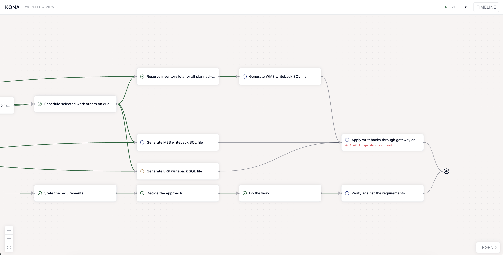

# Kona

**A living workflow graph — Beads with state machines.**



*A real run, mid-flight. The four grey-checked steps at the bottom are the skeleton it was
handed; everything above them the agent authored itself. One activity is spinning — `Generate ERP
writeback SQL file` is claimed and being worked right now, which is why it is not offered to
anything else. `Apply writebacks through gateway` says `3 of 3 dependencies unmet`: it knows
what it is waiting for.*

An agent's plan normally lives in its context window: you cannot see it, it cannot constrain
what the agent does next, and it dies with the session. Kona puts it in a file — a graph the
model authors, works against, and rewrites as reality answers, carrying the reason for every
change.

**You can see it.** A live graph, not a chat scroll. Steps are claimed before they are worked,
so a plan that goes quiet tells you *which step* it is quiet inside — and every mutation
carries a `--why` the store refuses to commit without.

**The agent is grounded by it.** `kona next` is the only source of work, and it is computed
from the log rather than remembered. A finished step is terminal: the store refuses to reopen
it, so work is not silently redone. This is enforcement, not advice — three invariants live in
the store, not in a prompt.

**And it survives.** Kill the session; a fresh one reads the file and continues. There is no
snapshot to rebuild, because the graph *is* a fold over the log.

## Why this is not already solved

Every property above exists somewhere. The three-way intersection does not, and for a
structural reason:

| | |
|---|---|
| **The mutator is a machine** | Adaptive BPM solved runtime workflow change in 2008, with rationale fields and all. It died because the mutator was an expert human with a BPMN editor. LLMs removed that bottleneck two years ago |
| **The timeline is irreversible** | AFlow, ADAS and DSPy optimise topology *between* runs, scored against a benchmark they re-execute. You cannot email thirty people five times and take the mean |
| **Waits outlive the process** | Temporal, LittleHorse, Golem, Hatchet and Trigger.dev all pin in-flight work to the version it started on. **Every replay-based engine buys crash-resume by forbidding mutation.** That unanimity is the evidence this is unsolved rather than merely unbuilt |

## How it's measured

The demo is a public benchmark, not a scenario we wrote: Terminal-Bench 3's
`production-planning` — reconcile an ERP, an MES and a warehouse into a schedule that
survives **20 constraint checks**. Four hours of expert time, authored by a manufacturing
engineer. `eval/` runs the same model on it twice, with Kona and without, and reports the
two arms side by side: constraints passed, wall-clock, cost, and how much of the plan the
agent actually maintained. Rig, pre-registration and go/no-go bar: [`docs/eval.md`](docs/eval.md).

Watch the arm that has Kona and the mechanism is visible. Given a five-activity skeleton and
nothing else, the agent:

- **authored its own plan** — 15 activities and 22 edges added in a single commit
- **claimed each step before working it**, so a plan that goes quiet says *which* step
- **caught its own mistake** — committed a `supersede_activity` carrying reason code
  `CONTRADICTION` when it found it had read a constraint wrong, with the correction in one
  sentence. Unprompted, inside a benchmark container

The arm without it finishes with a directory of `debug7.py` files that state no conclusion.

**We are not reporting a score.** One task and one attempt per arm cannot separate the tool
from run-to-run variance — we have watched the same configuration swing by eight checks — and
the suite scores this task all-or-nothing, so both arms read `0.0` regardless. The rig exists
so the comparison *can* be made properly. The interesting version is all 70 tasks with
repeats per arm; that is hours of wall-clock and real money per sweep, so it is **TBD**.

## What's inside

```
packages/core/    types, the 6 ops, 3 invariants, fold. ZERO deps, no fs, no clock, no model
packages/kona/    .kona/ layout, lock + CAS, the 9 verbs. The only thing that writes
packages/viewer/  React Flow + dagre over the log. Depends on core ONLY — it cannot reach
                  the store, because it does not depend on the package that is one
plugin/           the Claude Code plugin: two skills, an executor subagent, a SessionStart
                  hook. Where ALL the judgment lives
eval/             the measurement rig: the benchmark task, both arms, the analysis
```

The dependency graph enforces what prose can only assert: `core` has no `node:fs` to import,
so exactly one package writes bytes.

**Nine verbs, and no tenth.** `init` · `mutate` (the only write path: validate → lock → CAS →
append → fsync) · `graph` (the only read contract — a **fold** over the log, never a snapshot)
· `next` (the ready frontier, computed never stored) · `brief` · `effect reserve|record` (the
outbox) · `resume` · `poll` · `view`.

**Three invariants, enforced in the store rather than advised in a prompt:** terminal and
effect protection · predicate-waits stay satisfiable · effects are bounded and addressed.

## Try it

```bash
bun install && bun run check
alias kona="bun $PWD/packages/kona/src/bin.ts"
mkdir /tmp/plan && cd /tmp/plan && kona init
```

Full walkthrough of the ops, the refusal and the exit codes:
[`docs/spec.md`](docs/spec.md).

### Run the demo

The benchmark A/B: the same model on `production-planning` twice, with Kona and without.

> **This takes hours, not minutes, and costs real money.** Pre-flight builds six Docker
> images (~10–20 min, cold). The run itself is capped at two hours and both arms are billed
> the whole time: **~$10–28 on Sonnet 5**, **~$3 on DeepSeek V4-Flash**. Set a spend limit on
> the account first — a wrong flag here is expensive, not just slow.

```bash
eval/run/00-preflight.sh              # no API key, no tokens: installs Harbor, builds the
                                      # images, proves the Kona layer installs in them
echo 'ANTHROPIC_API_KEY=sk-...' > eval/.env        # gitignored. Or DEEPSEEK_API_KEY.

eval/run/01-probe.sh                  # ~15 min, ~$0.30 — measures the real cost per run
                                      # before you commit to a full one. Do not skip it.

KONA_INSTRUCTED=1 KONA_SEED=1 TASKS=production-planning \
  MODEL=anthropic/claude-sonnet-5 MULT=2.0 N_CONCURRENT=2 \
  eval/run/detached.sh 02-ab.sh       # detached: survives your terminal closing
```

Watch it while it runs — the graph is a file, so a second process can read it live:

```bash
eval/bin/pull-pursuit.sh --watch &    # copies the pursuit out of the container every 10s
cd eval/report/live && kona view      # http://127.0.0.1:4747
```

Only one arm has a graph to watch. The other has no Kona, so there is nothing to open —
which is the comparison, not a gap in the tooling.

When it finishes:

```bash
bun eval/analyze/paired.ts eval/jobs        # per-arm checks passed, wall-clock, cost
bun eval/analyze/trajectory.ts eval/jobs    # adoption, redo rate, looping
```

The suite scores this task all-or-nothing, so **both arms will read `0.0`** — read the check
count, not the reward. [`docs/eval.md`](docs/eval.md) explains why, and carries the frozen
pre-registration the run is measured against.

## Tech stack

**TypeScript 7** (the native Go compiler) on **Bun** — one runtime for the CLI, the tests and
the bundler, and `bun build --compile` gives a single static binary with no Activity in the image.
**Zod** at the CLI boundary, so malformed shape is rejected before any graph logic runs.
**React 19 + @xyflow/react + dagre + Tailwind 4** for the viewer, served by Bun over localhost
with zero outbound calls. Storage is **one append-only JSONL file** — no database, no daemon,
no snapshot.

The eval rig runs on **Harbor** (the benchmark's own harness) with **Terminus-2** as the agent
and **LiteLLM** for model routing, so any provider works: the runs behind this README were
Claude Sonnet 5 and DeepSeek V4-Flash.

`bun run check` — typecheck, lint, knip, **1,238 tests**. Mutation-score floors of 100 on
`validate()` and `fold()`.

More: [`docs/prd.md`](docs/prd.md) · [`docs/spec.md`](docs/spec.md) ·
[`docs/eval.md`](docs/eval.md) · [`docs/prfaq.md`](docs/prfaq.md)
